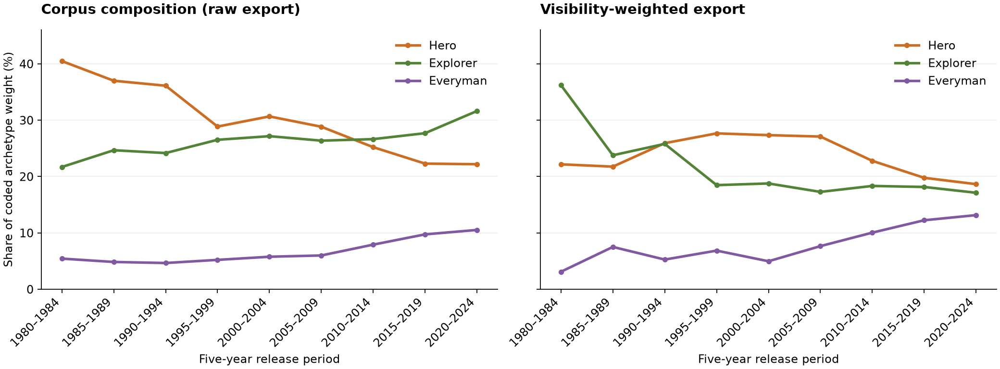
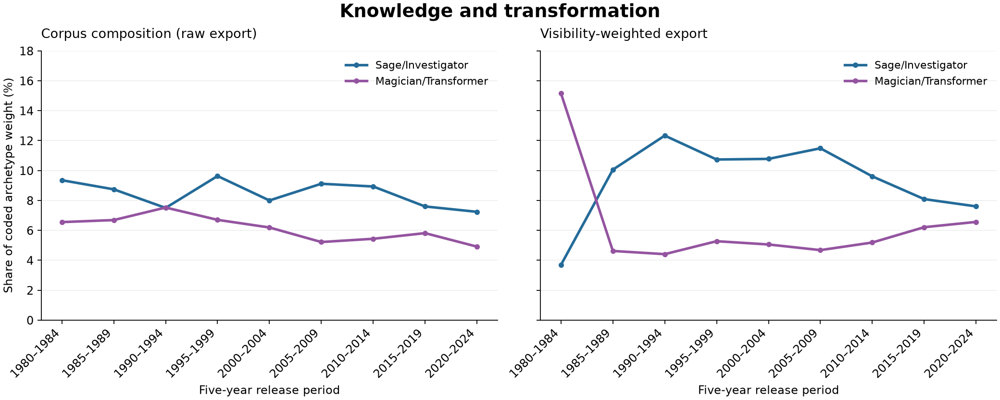
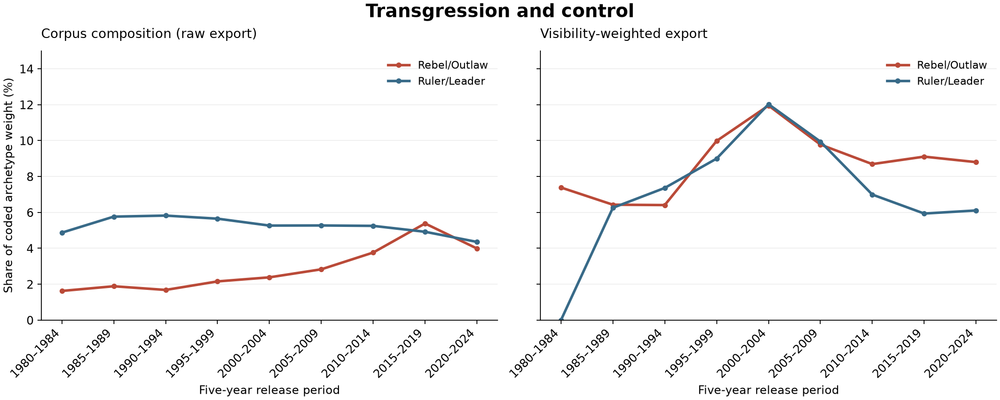
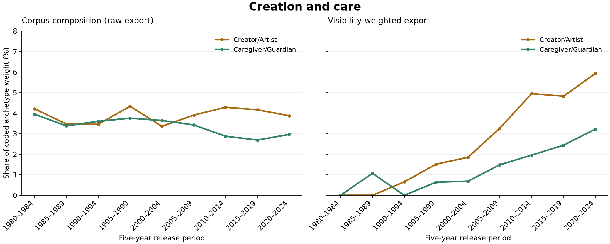
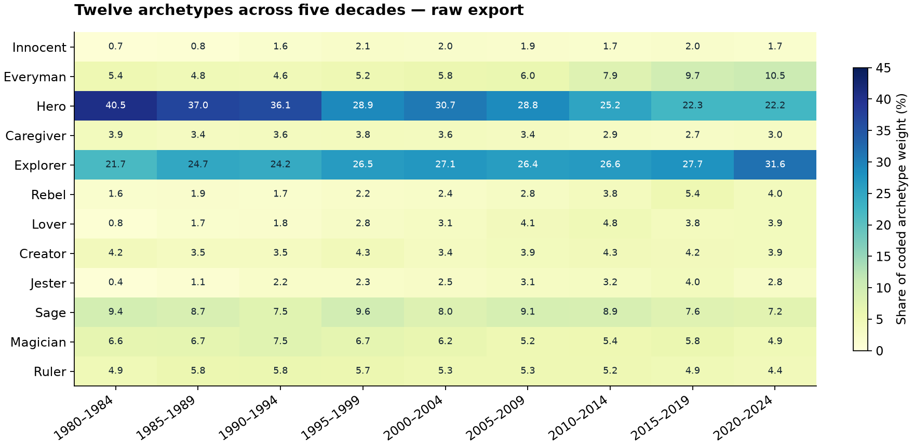

# Beyond the Hero: 12 archetypes for 90,000+ game protagonists

**If you use these data or research materials, we kindly ask you to cite the accompanying paper. Thank you for acknowledging the work behind this dataset.**

Radek Richtr. *Beyond the Hero: A Diachronic Study of Archetypal Shifts in Playable Protagonists Across Five Decades*. ICIDS 2026, accepted paper.

```bibtex
@inproceedings{richtr2026beyondhero,
  author    = {Richtr, Radek},
  title     = {Beyond the Hero: A Diachronic Study of Archetypal Shifts in Playable Protagonists Across Five Decades},
  booktitle = {International Conference on Interactive Digital Storytelling (ICIDS 2026)},
  year      = {2026},
  note      = {Accepted paper. Final proceedings metadata forthcoming}
}
```

[Download BibTeX](CITATION.bib) · [How the data and evaluation were created](docs/how-the-evaluation-was-created.md) · [All game data](docs/data-catalogue.md) · [Findings and figures](docs/results.md) · [Paper](paper/README.md)

## What data will you find here?

The analytical export contains **90,387 protagonist-level records**, representing **90,180 title–year combinations and 89,043 distinct game-title strings**. It covers release years 1970–2025; the main historical interpretation focuses on 1980–2024. The repository also preserves the larger source catalogues: **171,570 Steam application IDs** and **278,617 IGDB records**, together with SteamSpy metadata and intermediate datasets. The source catalogues overlap and include games outside the analytical subset.

For games and playable protagonists, the available coding records identify or estimate:

- **Who or what the player controls:** a named protagonist, an avatar, an ensemble, or a player role, together with protagonist type where available.
- **Archetypal functions:** ranked primary, secondary and tertiary labels within a twelve-category framework, such as Hero, Explorer, Caregiver, Creator or Ruler.
- **Interpretive attributes:** confidence, player projection, narrative complexity, evidence basis and flags for manual review in the richer coding tables.
- **Historical and catalogue context:** release year, genres and other source metadata, review/rating counts, and derived visibility weights where available.

The simplified analytical files contain a compact selection of these fields; the full masters preserve richer metadata, original labels and subsequent harmonizations. Field availability varies by source and processing stage. A confidence score or a manual-review flag is not itself evidence of human verification.

**A subset was assessed against human annotations.** The paper reports a comparison of **1,522 retained domain-aware responses covering 834 character IDs**. Manual inspection and follow-up discussions with annotators also informed the interpretation of disagreements. This provides human assessment of selected cases, not confirmation of every label in the full corpus. The release includes the annotation interface and documented comparisons; the final participant-level export and a complete row-by-row human-verified subset are not included. See [how the evaluation was created](docs/how-the-evaluation-was-created.md#7-participant-annotation-and-filtering).

## What this study asks

How have playable protagonist archetypes changed across five decades of games? A protagonist can be an authored fictional character, a silent avatar, a customizable figure, an ensemble, or an implicit role such as a ruler or creator. The study therefore distinguishes **the archetype of the character** from **the role made available to the player**.

Twelve predefined categories provide a shared vocabulary; ranked primary, secondary and tertiary labels allow multiple functions within one record. The analysis describes historical distributions within this framework. It does not classify players' personalities or identify the causes of historical change.

## From heroic exploration to exploratory heroism

In the archived raw-share series, Hero's relative share decreases while Explorer's increases. This does not mean heroic protagonists disappear: the interpretation concerns their relative prominence and their combinations with other roles.



| Archetype | Raw share, 1980–1984 | Raw share, 2020–2024 |
|---|---:|---:|
| Hero / Warrior | 40.5% | 22.2% |
| Explorer / Seeker | 21.7% | 31.6% |
| Everyman / Orphan | 5.4% | 10.5% |

These percentages describe shares of coded archetype weight, not player numbers or sales. The visibility-weighted view answers a different question and does not reproduce every raw trend: its 2020–2024 Hero and Explorer shares are 18.6% and 17.1%, respectively. The overview plots are reproducible renderings of preserved aggregate CSV exports, not newly inferred labels.

## Investigator and Magician: knowledge and transformation

**Sage / Investigator remains a recurring protagonist function across all nine periods.** In the visibility-weighted series, its share stays between **10.1% and 12.3% from 1985–2009**, then falls to **7.6% in 2020–2024**. The raw series fluctuates more modestly, reaching its highest share of **9.6% in 1995–1999** and ending at **7.2%**. Investigation therefore has its own trajectory alongside exploration and heroic action.



Magician / Transformer provides a different profile: its weighted share is highest in **1980–1984 (15.2%)**, whereas its raw share peaks in **1990–1994 (7.5%)**. By 2020–2024 the respective shares are **6.6% and 4.9%**. The timing of prominence depends on which view of the corpus we examine; these category labels describe coded functions rather than counts of detective or fantasy games.

## Outlaw and Ruler: transgression and control

**Rebellion and authority share a visibility-weighted peak in 2000–2004:** Rebel / Outlaw reaches **12.0%**, and Ruler / Leader also reaches **12.0%**. Both subsequently lose relative share, ending at **8.8% and 6.1%**, respectively. Two contrasting functions thus become especially prominent in the same weighted release period.



The raw view separates their trajectories. Outlaw rises from **1.6% in 1980–1984** to a peak of **5.4% in 2015–2019**, before ending at **4.0%**. Ruler stays within **4.4–5.8%** across the nine periods. Their shared weighted peak is a pattern of the aggregate distribution; it does not establish that the two labels occur together in individual protagonists.

## Creator and Caregiver: making and protecting

**Creation and care become more prominent in the later visibility-weighted periods.** Creator / Artist rises from **1.8% in 2000–2004** to **5.9% in 2020–2024**, while Caregiver / Guardian rises from **0.7% to 3.2%**. These smaller categories reveal changes that are harder to see on a scale dominated by Hero and Explorer.



Their raw shares tell a more restrained story: Creator fluctuates between **3.4% and 4.3%**, and Caregiver ends at **3.0%**, below its early **3.9%**. The recent weighted rise therefore does not describe an equivalent rise throughout the raw corpus. Each comparison uses the same vertical scale in its two panels; scales differ between comparisons to keep the smaller categories legible.

All six series come from the preserved [raw](results/tables/raw_archetype_shares_1980_2024.csv) and [visibility-weighted](results/tables/visibility_weighted_archetype_shares_1980_2024.csv) tables. [Regenerate these three figures](tools/plot_archetype_stories.py) without rerunning the model or processing the full archive.

## The full twelve-category picture



Protagonist form also matters. In the recovered typed subset, silent avatars emphasize Explorer (25.8%), while systemic roles emphasize Ruler (33.0%) and Creator (15.6%). These patterns connect archetypal functions with the actions and positions games make playable.

The [results page](docs/results.md) includes the full twelve-category endpoint table, protagonist-type comparisons, source links and interpretation limits. Annual matrices, alternative weighting schemes, original heatmaps, PGFPlots sources and further tables are preserved in the [complete file index](docs/recovered-file-index.md).

## The data behind the study

The release includes **complete recovered game catalogues and processing outputs**, including records outside the selected analytical corpus. The archive covers 582 source files, represented by 487 distinct archived files after byte-identical duplicate detection. These contain approximately 3.04 GB of unique original material in approximately 832 MB of archive storage. Large text files use lossless gzip compression; they are not samples.

| Layer | Size | Where to start |
|---|---:|---|
| Downloaded Steam catalogue | 171,570 application IDs | [Data catalogue](docs/data-catalogue.md) |
| SteamSpy all-snapshot | 82,251 application IDs | [Data catalogue](docs/data-catalogue.md) |
| Merged Steam-side catalogue | 177,809 application IDs | [Data catalogue](docs/data-catalogue.md) |
| Downloaded IGDB catalogue, all acquired years | 278,617 records | [Data catalogue](docs/data-catalogue.md) |
| IGDB broad candidates through 2025 | 194,354 records | [Acquisition and selection](docs/how-the-evaluation-was-created.md) |
| Steam batch selection | 50,000 games; 49,979 available LLM results | [Models, prompts and times](docs/how-the-evaluation-was-created.md#4-llm-assisted-pre-coding-prompts-inputs-models-and-time) |
| Analytical visibility export | 90,387 protagonist rows | [Count reconciliation](docs/corpus-counts.md) |
| Distinct non-empty title–year combinations | 90,180 | [Corrected period table](results/tables/title_year_counts_corrected.csv) |
| Distinct exact title strings | 89,043 | [Meaning of the counts](docs/corpus-counts.md) |

The layers overlap and **must not be added together**. A title string, a title–year combination, a protagonist row and an annotation are different units. One blank-title record explains the difference between the original 90,181-combination table and the corrected 90,180 count; both the original material and the separate correction are retained.

## How the evaluation was created

The [method page](docs/how-the-evaluation-was-created.md) explains acquisition from Steam/SteamSpy and IGDB, source matching, model inputs, prompt versions, LLM batch runs, twelve-category harmonization, metadata-based coding and participant annotation.

- **Prompts and schemas:** [prompt index](prompts/index.json), original preparation scripts and instantiated batch inputs.
- **Models:** recorded Steam runs use `gpt-5.5-2026-04-23` and `gpt-5.4-mini-2026-03-17`.
- **Time:** [recorded job timeline](docs/run-timeline.md), distinguishing submission, completion, failed runs and unknown times.
- **Annotation interface:** [archived demonstration](annotation-interface/), with collection disabled.
- **Game–character–LLM–source comparison:** [cited examples](comparison/initial_comparison.md), keeping published terminology separate from proposed mappings to this codebook.

The recovered IGDB metadata branch also uses rules and explicit title mappings; not every code is a direct LLM prediction. Some intermediate transformations and the base IGDB annotation module remain missing. The final participant export has not been recovered. This release provides the available evidence without claiming complete end-to-end reproducibility or full-corpus human validation.

## Explore and verify locally

```sh
git clone https://github.com/richtrad/beyond-hero-icids2026-data.git
cd beyond-hero-icids2026-data
python tools/verify_materials.py
python tools/verify_release.py
```

To regenerate the overview figures and descriptive tables, install the packages listed in [requirements-overview.txt](requirements-overview.txt), then run `python tools/build_overview.py`. This is an offline analysis of archived files; no model calls or paid inference are launched.

To try the annotation interface, run `python -m http.server 8173 --bind 127.0.0.1` and open `http://127.0.0.1:8173/annotation-interface/`. The demo stores responses locally in the browser under a separate prefix and does not submit them to the study.

[Checksums and source aliases](provenance/data-manifest.csv) make every archive file traceable. Original game metadata retain their source attribution; the citation request above does not assign new rights to third-party content. Participant-level response exports, credentials and the original collection backend are not included.

## Full article

The complete camera-ready PDF will be added to [paper/](paper/README.md) after the manuscript revisions are finalized. The [BibTeX citation](CITATION.bib) will be updated with the DOI, pages and final proceedings details when available.
